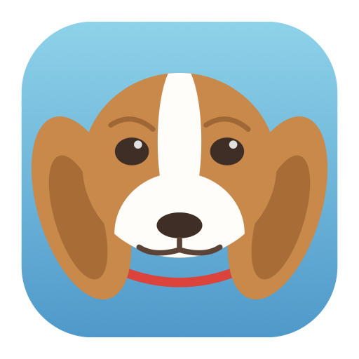

<div align="center">



# Beagle

**Local voice in, local voice out — for macOS.**

Press a key, speak, and your words land in whatever app you were typing in.
Drop text on the orb, and your Mac reads it back. Nothing leaves the machine.

[](https://github.com/loom-labs/beagle/actions/workflows/ci.yml)
[](LICENSE)
[](#requirements)

</div>

---

## What it does

| | |
|---|---|
| **Dictate anywhere** | Hold a hotkey, talk, release. The transcript is pasted at your cursor in any app. |
| **Read anything aloud** | Select text and hit a hotkey, or drag text and files onto the floating orb. |
| **Read the screen** | Snap a region of the screen; Beagle OCRs it and speaks it. |
| **Stay out of the way** | A 44-point orb and a menu bar icon. No Dock tile, no window unless you ask. |

## Shortcuts

| Action | Shortcut |
|---|---|
| Dictate — hold to talk, or press to toggle | ⌃⌥L |
| Speak the current selection (press again to stop) | ⌃⌥S |
| Capture a screen region and read it aloud | ⌃⌥R |

You can also drop text or a `.txt`/`.md` file onto the orb to hear it, or click
the orb to start dictating.

Everything runs on the Apple Neural Engine. No API keys, no network calls after
the first model download, no telemetry.

## Why it is fast

Beagle is a single statically linked Swift binary — roughly 8 MB, no Electron,
no Python, no bundled runtime. Inference is offloaded to the ANE rather than the
GPU, which is what keeps it usable as an always-on background app instead of
something that spins your fans.

| | Model | Size | Speed |
|---|---|---|---|
| Speech → text | [Parakeet TDT v3](https://huggingface.co/nvidia/parakeet-tdt-0.6b-v3) (0.6 B, int8) | ~650 MB | ~120× realtime |
| Text → speech | [Kokoro-82M](https://huggingface.co/hexgrad/Kokoro-82M) (Apache-2.0) | ~330 MB | 3–11× realtime |

Both run through [FluidAudio](https://github.com/FluidInference/FluidAudio), an
Apache-2.0 Swift SDK that ships Core ML conversions of both models. Weights are
downloaded once on first use and cached in
`~/Library/Application Support/FluidAudio/Models`, shared with any other
FluidAudio-based app you already run.

**Website:** [loom-labs.github.io/beagle](https://loom-labs.github.io/beagle) ·
**Download:** [latest release](https://github.com/loom-labs/beagle/releases/latest)

## Requirements

- macOS 14 (Sonoma) or later
- Apple Silicon (M1 or newer) — the Core ML graphs are ANE-only, there is no
  Intel build
- ~1 GB of disk for model weights

## Install

### Homebrew

```bash
brew tap loom-labs/beagle https://github.com/loom-labs/beagle
brew install --cask beagle
```

Homebrew 6.0 removed `--no-quarantine`, so the first launch is blocked either
way: open System Settings → Privacy & Security and click **Open Anyway**.

That is a one-time step rather than a per-upgrade one. Homebrew carries the
approval forward on upgrade, but only when the app's signing identity has not
changed — see below.

### Direct download

Grab the DMG from [the latest release](https://github.com/loom-labs/beagle/releases/latest),
drag Beagle to Applications, then clear the quarantine flag:

```bash
xattr -dr com.apple.quarantine /Applications/Beagle.app
```

Or: System Settings → Privacy & Security → **Open Anyway**.

### Why approval is one-time

Both Gatekeeper approval and the Accessibility grant are keyed to the app's code
signature, and every release is signed with the same certificate. Approve and
grant once; upgrades keep both.

### Why the warning exists

The build is signed ad-hoc, not notarized. Notarization requires a paid Apple
Developer Program membership; until this project has one, macOS has no issuer to
check the signature against. The release workflow already supports notarizing —
it activates automatically once the signing secrets are configured.

### After installing

Grant Accessibility when asked, **then relaunch Beagle**. macOS only hands the
permission to a freshly launched process, so until you do, dictation copies to
the clipboard instead of pasting. Beagle detects this state and offers a
Relaunch button rather than leaving you guessing.

## Permissions

Beagle asks for three things, each only when you first use the feature that
needs it:

| Permission | Needed for | Where |
|---|---|---|
| Microphone | Dictation | System Settings → Privacy & Security → Microphone |
| Accessibility | Pasting text at your cursor, reading your selection | → Accessibility |
| Screen Recording | Screenshot-to-speech | → Screen Recording |

If Accessibility is off, Beagle still transcribes — the text goes to your
clipboard instead of being pasted, and the menu bar says so. You never lose a
transcript because a permission is missing.

### "I already granted Accessibility and it keeps asking"

macOS ties that grant to the app's **code signature**. Release builds are
ad-hoc signed, which means the signature is a hash of the binary — so a
different build of Beagle is, as far as macOS is concerned, a different app.
Upgrading to a new version invalidates the previous grant.

Remove the stale entry and add the new one:

1. System Settings → Privacy & Security → Accessibility
2. Select Beagle, press **−**, then **+** and pick `/Applications/Beagle.app`

If you build from source and hit this on every rebuild, create a stable signing
identity once:

```bash
./Scripts/make-signing-identity.sh && ./Scripts/build-app.sh --sign "Beagle Dev"
```

The grant then survives rebuilds.

## Development

```bash
swift build          # debug build
swift test           # unit tests
swift format lint -r -s Sources Tests   # lint
./Scripts/build-app.sh                  # assemble Beagle.app
```

The package splits into three targets: `BeagleCore` (audio, speech engines,
settings — no AppKit), `BeagleUI` (SwiftUI views), and `BeagleApp` (lifecycle,
hotkeys, windows). See [CONTRIBUTING.md](CONTRIBUTING.md) for the branch and
commit conventions.

## Releasing

Releases are cut automatically when a pull request merges to `main` with
`#patch`, `#minor`, or `#major` in its title. Nothing needs running by hand.

### One-time: the release signing certificate

**Maintainers only — users never run this.**

```bash
Scripts/make-release-identity.sh
```

Run once for the lifetime of the project. It generates a self-signed certificate
and uploads it to GitHub Actions as an encrypted secret, after which every
release is signed with the same identity.

That stability is what makes approval stick. Both Gatekeeper and macOS TCC key
their decisions to the code signature, so an ad-hoc build — whose hash changes
every time — looks like a different application on every upgrade, and users have
to re-approve Gatekeeper and re-grant Accessibility each release.

It does not remove the first-launch Gatekeeper warning. That needs notarization,
which needs a paid Apple Developer Program membership. The release workflow
notarizes automatically if `APPLE_ID`, `APPLE_TEAM_ID`, and `APPLE_APP_PASSWORD`
are set; without them it signs and ships unnotarized.

## License

[Apache 2.0](LICENSE). Model weights carry their own licenses — Kokoro-82M is
Apache-2.0, Parakeet TDT v3 is CC-BY-4.0.
